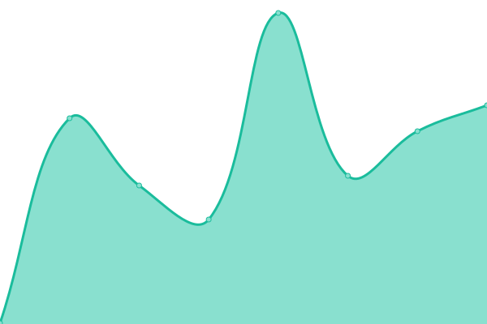

# [📈 Live Status](https://status.jamiedubs.com): <!--live status--> **🟧 Partial outage**

This repository contains the open-source uptime monitor and status page for [Upptime](https://upptime.js.org), powered by [Upptime](https://github.com/upptime/upptime).

With [Upptime](https://upptime.js.org), you can get your own unlimited and free uptime monitor and status page, powered entirely by a GitHub repository. We use [Issues](https://github.com/upptime/upptime/issues) as incident reports, [Actions](https://github.com/jamiew/uptime-monitor/actions) as uptime monitors, and [Pages](https://status.jamiedubs.com) for the status page.

<!--start: status pages-->
<!-- This summary is generated by Upptime (https://github.com/upptime/upptime) -->
<!-- Do not edit this manually, your changes will be overwritten -->
<!-- prettier-ignore -->
| URL | Status | History | Response Time | Uptime |
| --- | ------ | ------- | ------------- | ------ |
|  [jamiedubs.com](https://www.jamiedubs.com) | 🟩 Up | [jamiedubs-com.yml](https://github.com/jamiew/uptime-monitor/commits/HEAD/history/jamiedubs-com.yml) | 

 228ms
     
 | 

<a href="https://status.jamiedubs.com/history/jamiedubs-com">100.00%</a>
    

|  [Blackbook](https://000000book.com) | 🟩 Up | [blackbook.yml](https://github.com/jamiew/uptime-monitor/commits/HEAD/history/blackbook.yml) | 

 404ms
     
 | 

<a href="https://status.jamiedubs.com/history/blackbook">100.00%</a>
    

|  [Gawds](https://www.gawds.xyz) | 🟩 Up | [gawds.yml](https://github.com/jamiew/uptime-monitor/commits/HEAD/history/gawds.yml) | 

 221ms
     
 | 

<a href="https://status.jamiedubs.com/history/gawds">100.00%</a>
    

|  [Void Runners](https://voidrunners.io) | 🟩 Up | [void-runners.yml](https://github.com/jamiew/uptime-monitor/commits/HEAD/history/void-runners.yml) | 

 430ms
     
 | 

<a href="https://status.jamiedubs.com/history/void-runners">100.00%</a>
    

|  [Star Wars Uncut](https://www.starwarsuncut.com) | 🟩 Up | [star-wars-uncut.yml](https://github.com/jamiew/uptime-monitor/commits/HEAD/history/star-wars-uncut.yml) | 

 190ms
     
 | 

<a href="https://status.jamiedubs.com/history/star-wars-uncut">100.00%</a>
    

|  [RickrollDB](https://rickrolldb.com/) | 🟩 Up | [rickroll-db.yml](https://github.com/jamiew/uptime-monitor/commits/HEAD/history/rickroll-db.yml) | 

 147ms
     
 | 

<a href="https://status.jamiedubs.com/history/rickroll-db">100.00%</a>
    

|  [Occupy Internet](http://occupyinter.net) | 🟩 Up | [occupy-internet.yml](https://github.com/jamiew/uptime-monitor/commits/HEAD/history/occupy-internet.yml) | 

 133ms
     
 | 

<a href="https://status.jamiedubs.com/history/occupy-internet">100.00%</a>
    

|  [fffff.at](http://fffff.at) | 🟩 Up | [fffff-at.yml](https://github.com/jamiew/uptime-monitor/commits/HEAD/history/fffff-at.yml) | 

 489ms
     
 | 

<a href="https://status.jamiedubs.com/history/fffff-at">100.00%</a>
    

|  Homelab | 🟥 Down | [homelab.yml](https://github.com/jamiew/uptime-monitor/commits/HEAD/history/homelab.yml) | 

 0ms
     
 | 

<a href="https://status.jamiedubs.com/history/homelab">0.00%</a>
    

<!--end: status pages-->

[**Visit our status website →**](https://status.jamiedubs.com)

## 📄 License

- Powered by: [Upptime](https://github.com/upptime/upptime)
- Code: [MIT](./LICENSE) © [Upptime](https://upptime.js.org)
- Data in the `./history` directory: [Open Database License](https://opendatacommons.org/licenses/odbl/1-0/)
